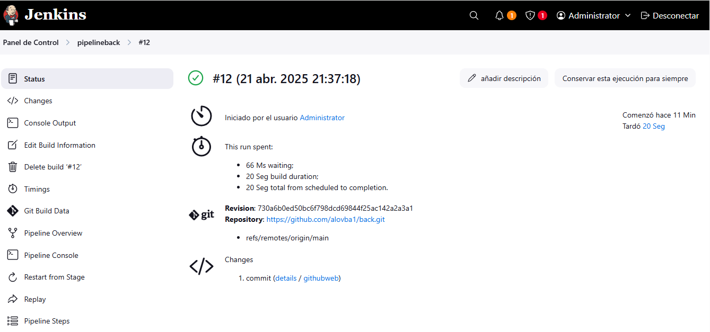

  Proyecto: Back

## ▪  Estructura del Pipeline

Este pipeline está compuesto por las siguientes etapas:

Configuracion en la plataforma de Jenkins:

1. **Construcción (Build):**

 Crear la tarea en jenkins

 crear le pipeline

 configurar el pipeline:

 Triggers:

 seleccionar GitHub hook trigger for GITScm polling

 Definition:

 seleccionar Pipeline script from 

 SMC: 
 seleccionar Git

 Repository URL: https://github.com/alovba1/back.git

 Branch Specifier (blank for 'any'):

 */main

 Script Path:

 Jenkinsfile

1.1 **Creacion del Archivo Jenkinsfile dentro del proyecto back:**

pipeline {

    agent any

    stages {
      

        stage('Setup Node.js Environment') {
            steps {
                withEnv(["PATH=C:\\Program Files\\nodejs;${env.PATH}"]) {
                    bat 'node --version'
                    bat 'npm --version'
                }
            }
        }

        stage('Check Environment') {
            steps {
                bat 'echo %PATH%'
                bat 'node --version'
                bat 'npm --version'
            }
        }

        stage('Run Tests') {
            steps {
                bat 'npm test'
            }
        }

      stage('Build') {
    steps {
        bat 'docker build -t backend-image .'
        bat 'docker tag backend-image backend-image:latest'
        bat 'docker run -d -p 3000:3000 --name backend-container backend-image'

        script {
            def result = bat(script: "docker ps | findstr backend-container", returnStatus: true)
            if (result != 0) {
                echo "Error detectado, realizando rollback..."
                bat "docker stop backend-container"
                bat "docker run -d -p 3000:3000 --name backend-container backend-image:previous"
            }
        }
    }
}
    }

    post {
        success {
            echo 'Backend pipeline completed successfully!'
        }
       failure {
        mail to: 'curribifine@gmail.com',
             subject: 'Error en el Pipeline de Jenkins!',
             body: 'Hubo un error en el despliegue de Docker. Revisa los logs en Jenkins.'
    }
    }
}

2. **Pruebas (Testing):**

 stage('Run Tests') {
            steps {
                bat 'npm test'
            }
        }

3. **Despliegue (Deployment):**

 bat 'docker build -t backend-image .'

 bat 'docker tag backend-image backend-image:latest'

 bat 'docker run -d -p 3000:3000 --name backend-container backend-image'

4. **Monitoreo (Monitoring):**

**En el archivo Dokerfile:**

**asegurar de que el contenedor está funcionando correctamente**

HEALTHCHECK --interval=10s --timeout=5s --start-period=5s \

CMD curl -f http://localhost:3000/api/message || exit 1

5. **Gestión ante fallos o errores (rollback o alertas).**

> **¿ por qué fue diseñado así?**  
Fue diseñado para asegurar calidad desde etapas tempranas, reducir errores y facilitar el despliegue continuo.

## ▪ Cómo ejecutar localmente.

1. **Clona el repositorio del back ej en una consola de gitbush:**

   git clone https://github.com/alovba1/back.git

   cd back

  **ejecutar el proyecto en una consola  ej visual studio code**

   npm start

**indica que el proyecto esta ejecutando en:**

Servidor corriendo en http://localhost:3000

**url comprobar que fuciona:**

http://localhost:3000/api/message

2. **Clona el repositorio front ej en una consola de gitbush:**

git clone https://github.com/alovba1/front.git

cd front

  **ejecutar el proyecto en una consola  ej visual studio code**
  ng serve

  Angular servidor corriendo en http://localhost:4200/ 

  **url comprobar que fuciona:**

http://localhost:4200/ 

## ▪ Probar el despliegue

instalar Jenkins localmente

Accede a: http://localhost:8080

Por ejemplo: 

Usuario: admin

Contraseña: admin

Configuracion en la plataforma de Jenkins:

 Crear la tarea en jenkins

 crear le pipeline

 configurar el pipeline:

 Triggers:

 GitHub hook trigger for GITScm polling

 Definition:

 Pipeline script from 

 SMC:Git

 Repository URL: https://github.com/alovba1/back.git

 Branch Specifier (blank for 'any'):

 */main

 Script Path:

 Jenkinsfile

 **ejecutar el pipeline:**
seleccionar el pipeline creado

ejecutar el pipeline creado

seleccionar el # de Build ejecutando

 **Ver el resultado de Log:**

seleccionar la opcion Console Output

 **Comprobar la creacion de la imagen y el contenedor:**

ejutar el comando: 

docker search ej: backend-image:latest

otra forma: ir a https://hub.docker.com/

usa la barra de búsqueda para encontrar imágen.

en la cuadro de texto buscar la imagen ej: backend-image:latest

## ▪ Cómo conectarse al entorno de monitoreo y qué métricas están disponibles.

Para realizar el monitoreo de errores, alentas y verificar el rendimiento:

Se puede usar la herramienta Prometheus.

recolecta datos de diferentes servicios, esto lo realiza enviando peticiones http a una url.

llamada endpoint de metricas.

Para ver el analisis de graficas se puede utilizar la herramienta Grafana para el monitoreo de metricas.

## ▪ Cuáles serían los próximos pasos en una implementación real

1. Manejar el aumento de  en tráfico y escalabilidad conciderar husar Kubernetes en un ambien cloud ejemplo

Oracle Cloud, AzureDevOps, Aws etc..
2. Configuración de CI/CD Despliegue totalmente Automático

generacion de builds, despliegues en ambientes Dev, QA, Pre, Prod

3. Monitoreo errores y el rendimiento

Utilizar herramientas como Prometheus y Grafana

4. Implementación de Seguridad y Certificados SSL

Implementar certificados de Seguridad SSL 

por ejemplo utilizar JWT Tokens para autenticación segura

configurar reglas de seguridad

Utilizar API Gateway Cloud

5. Estrategia de Backup y Recuperación

